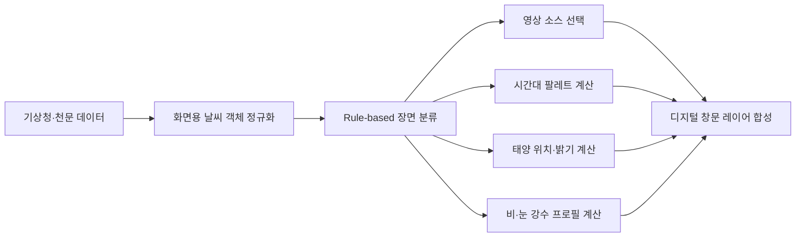
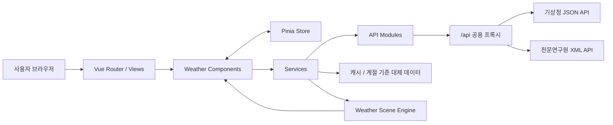

# SKY NOW

> 창문이 없는 공간에도 지금의 하늘을.

SKY NOW는 기상청 날씨와 한국천문연구원 일출·일몰 데이터를 숫자 목록에 머물게 하지 않고, 빛·구름·태양 위치·강수 효과로 번역하는 Vue 기반 **디지털 창문 서비스**입니다.

사용자는 전국의 날씨를 탐색할 수 있고, 선택한 지역의 현재 하늘을 업무 공간에 계속 띄워두거나 퇴근길에 필요한 정보만 빠르게 확인할 수 있습니다.

## 서비스가 제공하려는 경험

- 창밖을 보기 어려운 공간에서도 현재 시간과 날씨의 흐름을 직관적으로 느낍니다.
- 숫자를 전부 읽지 않아도 밝기, 구름량, 태양 위치와 강수 표현으로 상황을 파악합니다.
- 전국 지도에서 광역시·도와 시·군·구를 탐색하고 상세 날씨로 자연스럽게 이동합니다.
- 퇴근까지 남은 시간, 우산 필요 여부와 일몰까지 남은 빛을 업무 맥락에 맞게 확인합니다.
- 섭씨·화씨와 날씨 홈·디지털 창문 모드를 앱 전체에서 일관되게 전환합니다.

## 주요 화면

| 경로 | 화면 | 역할 |
| --- | --- | --- |
| `/` | 서비스 소개 | 12초 동안 일출부터 일몰까지의 데이터·빛·문장 변화를 시연합니다. |
| `/weather` | 날씨 홈 | 전국 17개 광역시·도, 지도, 검색, 지역 카드와 디지털 창문을 제공합니다. |
| `/weather/:cityId` | 상세 날씨 | 선택 지역의 기온, 습도, 강수, 바람과 오늘의 태양 정보를 보여줍니다. |
| `/scene-guide` | 디지털 창문 안내 | 날씨 데이터를 장면으로 변환하는 기준을 설명합니다. |
| 그 외 경로 | 404 | 잘못된 주소를 안내하고 날씨 홈으로 복귀시킵니다. |

### 12초 소개 장면의 의미

소개 화면은 실제 기상청 관측값과 오늘의 최저·최고기온을 기준으로 일출부터 일몰까지의 변화를 짧게 보여주는 **서비스 시연용 보간 장면**입니다.

- 화면의 시계는 실제 일출부터 일몰까지의 시간을 12초 안에서 이동합니다.
- 기온은 실제 최저·최고기온 사이를 낮의 진행률에 따라 보간합니다.
- 습도·구름량·풍속과 안내 문장도 장면 변화에 맞춰 함께 움직입니다.
- 소개 장면의 시간대별 값은 서비스 표현을 설명하기 위한 보간값이며, 기상청의 시간별 실측값을 뜻하지 않습니다.

## 핵심 기능

- 대한민국 17개 광역시·도와 229개 시·군·구 중심 좌표 탐색
- 기상청 초단기실황과 초단기예보 결합
- 한국천문연구원 XML 응답 기반 지역별 일출·일몰 및 박명 적용
- 전국 평균 기온을 기준으로 한 지도 핀의 상대 온도 표현
- 도시 검색, 지역 선택, 동적 상세 라우팅
- 구름량·풍속·강수·시간대 기반 영상과 날씨 효과 합성
- 실제 일출·일몰 사이 진행률을 이용한 태양 위치 계산
- 화면 밖 영상 정지, 탭 비활성화 감지와 강수 Canvas 중단
- API 실패 시 캐시 또는 계절·좌표 기준 대체 데이터 표시
- Pinia 기반 섭씨·화씨 및 화면 모드 전역 관리

## 디지털 창문 장면 엔진

SKY NOW의 배경은 하나의 날씨 영상을 단순 재생하지 않습니다. 기상청과 천문 데이터를 규칙 기반으로 해석한 뒤 여러 시각 레이어를 조합합니다.



### 1. 입력값 정규화

서비스 계층이 서로 다른 API 응답을 하나의 날씨 객체로 합칩니다.

| 입력 | 엔진에서 사용하는 값 |
| --- | --- |
| 기상청 초단기실황 | 기온, 습도, 강수 형태, 1시간 강수량, 풍향, 풍속 |
| 기상청 초단기예보 | SKY 하늘 상태, 가까운 시각의 날씨, 18시 퇴근길 예보 |
| 한국천문연구원 출몰시각 | 일출, 일몰, 시민박명, 낮 길이 |
| 지역 고정 데이터 | 지역명, 위도·경도, 상위 광역시·도 |
| 브라우저 현재 시각 | 낮 진행률, 태양 궤적, 시간대 문장 |

### 2. Rule-based 장면 분류

`sceneClassifier.js`는 `PTY`, `SKY`, 강수 강도, 구름량, 습도, 풍속과 낮·밤 상태를 우선순위 규칙으로 판정합니다.

| 우선순위 | 조건 예시 | 장면 그룹 예시 |
| --- | --- | --- |
| 1. 강수 | PTY와 RN1에 비·눈 정보가 있음 | 이슬비, 약한 비, 보통 비, 강한 비, 소나기, 진눈깨비, 눈, 뇌우 |
| 2. 하늘 | SKY=4 또는 구름량이 높음 | 짙게 흐림, 습한 흐림 |
| 3. 바람 | 풍속이 높고 구름이 존재함 | 바람 부는 하늘 |
| 4. 구름량 | 구름량이 중간 범위임 | 구름 조금, 구름 많음 |
| 5. 시간대 | 일출·골든아워·낮·밤 | 맑은 낮, 맑은 밤, 노을빛 하늘 |

강수를 가장 먼저 판단하는 이유는 비나 눈이 오는 상황에서 단순히 `흐림` 장면으로 덮이지 않게 하기 위해서입니다. 각 분류 결과의 사용자용 이름과 설명은 `sceneProfiles.js`에서 관리합니다.

### 3. 영상 소스 선택 방식

`mediaManifest.js`가 사용할 영상과 다음 메타데이터를 관리합니다.

- `motionIndex`: 원본 영상에서 구름이 움직이는 상대적인 정도
- `opacityScale`: 날씨 장면에 합성할 기본 농도
- `blurPx`: 서로 다른 영상 질감을 맞추기 위한 보정값
- `containsSun`: 영상 자체에 태양이 포함되어 있는지 여부
- `loopFadeSeconds`: 반복 재생 경계를 부드럽게 연결할 시간

풍속에 맞추기 위해 한 영상의 재생 속도를 과도하게 바꾸면 압축 픽셀과 끊김이 눈에 띕니다. 현재 엔진은 모든 영상을 원본 속도로 재생하고, 지역 풍속을 상대 움직임 지수로 변환해 가장 가까운 `motionIndex`를 가진 영상을 선택합니다.

현재 장면에서 사용하는 배경 묶음:

| 배경 묶음 | 적용 장면 |
| --- | --- |
| Medium / Distant Clouds | 맑음, 옅은 구름, 골든아워 |
| Overcast + Cloud Layers | 구름 많음, 흐림, 비, 습한 날씨 |
| Fast Clouds | 바람이 강한 흐린 날씨 |
| Night Sky | 맑거나 구름 낀 야간 |

영상 속 태양과 계산된 태양이 이중으로 보이지 않도록 태양이 없는 구름·밤하늘 소스만 선택합니다. 원본 출처와 라이선스는 `public/weather-mockup/videos/CREDITS.md`에서 관리합니다.

### 4. 태양·색상·강수 레이어 합성

- `scenePalette.js`: 일출, 오전, 정오, 오후, 일몰 색상 지점을 끊어 바꾸지 않고 RGB 값으로 연속 보간합니다.
- `LiveSun.vue`: 현재 시각이 일출과 일몰 사이에서 차지하는 비율로 태양의 X·Y 위치를 계산합니다.
- 구름량: 영상 불투명도, 전체 밝기와 태양 가림 정도에 반영합니다.
- `precipitationVisuals.js`: 강수 그룹별 입자 수, 낙하 속도, 길이, 투명도와 렌즈 물방울 수를 제공합니다.
- 장면 전환: 선택 지역이나 날씨가 바뀔 때 영상과 팔레트를 단계적으로 전환합니다.

### 5. 데이터 실패와 렌더링 비용 관리

- 최신 API 요청 실패 시 10분 브라우저 캐시를 확인합니다.
- 최신 캐시가 없으면 최근 저장 데이터, 마지막으로 계절·좌표 기준 대체 데이터를 사용합니다.
- 대체 데이터를 사용하면 화면에 데이터 기준을 표시해 실황과 혼동하지 않게 합니다.
- 화면 밖 영상과 비활성 탭의 영상·강수 Canvas를 일시 중지합니다.
- 컴포넌트가 사라질 때 타이머, 이벤트 리스너와 애니메이션 작업을 정리합니다.

## 기술 스택

| 영역 | 기술 |
| --- | --- |
| UI | Vue 3, Composition API |
| Routing | Vue Router |
| Global state | Pinia |
| HTTP | Axios |
| Map | Leaflet, OpenStreetMap |
| Build | Vite |
| Runtime | Node.js 운영 서버(API 프록시·SPA fallback·정적 파일) |
| Quality | Node Test Runner, ESLint, Oxlint, Oxfmt |

## 데이터 소스와 가공

| 데이터 | 제공처 | 응답 | 서비스에서 사용하는 값 |
| --- | --- | --- | --- |
| 초단기실황 | 기상청 단기예보 조회서비스 | JSON | 기온, 습도, 강수 형태·강수량, 풍향·풍속 |
| 초단기예보 | 기상청 단기예보 조회서비스 | JSON | 하늘 상태, 가까운 예보, 18시 퇴근길 정보 |
| 출몰시각 | 한국천문연구원 | XML | 일출, 일몰, 시민·항해·천문박명, 남중 시각 |
| 위치 | Browser Geolocation | 좌표 | 가장 가까운 프로젝트 시·군·구 선택 |
| 지도 | OpenStreetMap | 타일 | 대한민국 지역 탐색 배경 |

천문 XML은 브라우저의 `DOMParser`로 읽고 필요한 태그만 JavaScript 객체로 정규화합니다.

```text
<sunrise>0546</sunrise>
        ↓
{ sunrise: "0546" }
        ↓
"2026-08-13T05:46"
```

## 실행 구조



### 계층별 책임

```text
View
└─ 라우터가 선택하는 완성된 페이지

Component
└─ 지도, 카드, 검색, 영상처럼 페이지를 구성하는 UI·기능 단위

Composable
└─ 여러 컴포넌트가 재사용하는 반응형 계산 로직

Store
└─ 온도 단위, 보기 모드, 정보 패널처럼 여러 화면이 공유하는 상태

Service
└─ API 결과와 고정 지역 데이터를 화면용 날씨 객체로 결합

API
└─ 외부 요청, 응답 형식 확인과 오류 변환
```

## 프로젝트 구조

```text
sky-now/
├── public/
│   └── weather-mockup/          # 날씨 장면 이미지·영상과 출처
├── src/
│   ├── api/                     # Axios 요청, 기상청 JSON, 천문 XML 파싱
│   ├── assets/                  # 전역 CSS
│   ├── components/
│   │   ├── common/              # 슬롯 카드, 전역 온도 토글
│   │   └── weather/             # 검색, 카드, 지도, 태양, 영상, 강수 표현
│   ├── composables/             # 온도 변환, 브라우저 날씨 캐시
│   ├── data/
│   │   └── weather/             # 광역시·도와 시·군·구 고정 좌표
│   ├── features/
│   │   └── weather-scene/       # 장면 분류, 팔레트, 영상 선택, 강수 프로필
│   ├── router/                  # 페이지 및 동적 상세 라우트
│   ├── services/                # API 정규화, 결합, 캐시와 fallback
│   ├── stores/                  # Pinia 전역 설정
│   ├── views/                   # 서비스 소개, 홈, 상세, 안내, 404
│   ├── App.vue
│   └── main.js
├── server/                      # 운영 정적 서버, API 프록시, SPA fallback
├── tests/                       # 장면·좌표·지역·캐시 자동 테스트
├── .env.example                 # 키 이름만 제공하는 환경변수 템플릿
├── .env.local                   # 실제 키, Git 제외
├── vite.config.js               # Vite와 개발용 공용 프록시 연결
└── package.json
```

Vue 강의 실습 코드는 서비스 번들에서 분리되어 형제 폴더 `vue-course-labs`에 보관됩니다.

## 사용법과 활용 팁

### 처음 사용하는 순서

1. 첫 화면에서 12초 소개 장면으로 서비스가 날씨 데이터를 어떻게 풍경으로 표현하는지 확인합니다.
2. `지금 날씨 시작하기`를 눌러 날씨 홈으로 이동합니다.
3. 지도 핀 또는 오른쪽 지역 카드에서 광역시·도를 선택합니다.
4. 선택한 광역시·도의 시·군·구가 표시되면 원하는 지역을 다시 선택합니다.
5. `상세보기`로 수치 정보를 확인하거나 `디지털 창문`으로 현재 하늘 장면을 엽니다.

### 날씨 홈 사용 팁

- **도시 검색**: 서울, 부산 같은 광역시·도뿐 아니라 현재 불러온 시·군·구 이름도 검색할 수 있습니다.
- **지도 단계 이동**: 지도 핀을 누르면 해당 지역의 시·군·구를 불러옵니다. `전국 보기`를 누르면 다시 17개 광역시·도 화면으로 돌아갑니다.
- **온도 색상 읽기**: 지도 핀 색상은 절대적인 더위가 아니라 현재 전국 평균과 비교한 상대 온도를 의미합니다.
- **카드 선택과 상세보기**: 카드 본문 선택은 현재 현황을 바꾸고, `상세보기`는 기온·습도·강수·바람·일출·일몰을 더 자세히 보여줍니다.
- **현재 위치 갱신**: 위치 권한을 허용한 뒤 `현재 위치 갱신`을 누르면 좌표와 가장 가까운 프로젝트 지역의 날씨를 표시합니다. 권한을 허용하지 않으면 서울로 대체됩니다.
- **섭씨·화씨 전환**: 상단 온도 토글은 Pinia Store에 저장되어 홈, 상세와 디지털 창문에 동시에 적용됩니다.

### 디지털 창문 사용 팁

- **지역 바꾸기**: 상단 `하늘 지역` 목록에서 현재 위치, 광역시·도 또는 미리 불러온 시·군·구를 선택합니다.
- **풍경에 집중하기**: 마우스와 터치 입력이 약 2.2초 동안 없으면 조작 UI가 자연스럽게 사라집니다. 다시 움직이거나 터치하면 나타납니다.
- **짧은 문장**: 시간대와 날씨에 맞는 문장이 일정 간격으로 나타났다 사라집니다. 수치를 읽지 않아도 하루의 흐름을 느끼기 위한 기능입니다.
- **상세 정보 보기**: 현재 장면을 결정한 구름량, 습도, 풍속, 체감온도, 일출·일몰과 퇴근길 정보를 펼쳐볼 수 있습니다.
- **엔진 지수 확인**: 상세 패널의 `하늘 장면이 계산된 방식 보기`에서 밝기·구름·태양과 날씨 효과에 사용된 값을 확인합니다.
- **1분 창밖 보기**: 정보 UI를 접고 풍경만 보는 타이머입니다. 화면을 움직이면 종료 버튼이 잠시 나타나며 `Esc` 키로도 종료할 수 있습니다.
- **날씨 홈으로 돌아가기**: 왼쪽 위 `날씨 홈` 버튼을 누르면 선택 상태를 유지한 채 대시보드로 돌아갑니다.

### 데이터 문구 읽는 법

| 문구 | 의미 |
| --- | --- |
| 기상청 실황·예보 | 공공데이터 API에서 정상적으로 받은 최신 데이터 |
| 최근 저장 데이터 | API가 일시적으로 실패해 브라우저 캐시를 사용한 상태 |
| 계절·좌표 기준 기본 데이터 | API와 캐시를 사용할 수 없어 만든 대체값이며 실황이 아님 |
| 현재 위치 대신 서울 표시 | 위치 권한 거부 또는 브라우저 위치 조회 실패 |

> 디지털 창문은 현재 날씨를 직관적으로 해석하는 서비스입니다. 재난·안전 판단에는 기상청의 공식 특보와 최신 발표를 함께 확인해야 합니다.

## 로컬 실행

### 1. 요구 환경

- Node.js `20.19+` 또는 `22.12+`
- npm
- 공공데이터포털에서 발급받은 기상청 및 한국천문연구원 인증키

### 2. 프로젝트 이동 및 패키지 설치

```bash
cd /Users/woorivermountain/workspace/sky-now
npm install
```

### 3. 환경변수 준비

```bash
cp .env.example .env.local
```

`.env.local`에 실제 키를 입력합니다.

```dotenv
KMA_SERVICE_KEY=
ASTRONOMY_SERVICE_KEY=

# 선택 사항: 영상 CDN의 origin
VITE_MEDIA_BASE_URL=
```

공공데이터포털에서 받은 인코딩 키 또는 일반 키는 현재 프록시에서 한 번 정규화해 요청합니다. 키를 변경한 뒤에는 Vite 개발 서버를 반드시 다시 시작해야 합니다.

### 4. 개발 서버 실행

```bash
npm run dev
```

중복 Vite 서버 때문에 다른 프로젝트가 열리면 고정 포트를 사용합니다.

```bash
npm run dev -- --port 5180 --strictPort
```

## 명령어

| 명령어 | 역할 |
| --- | --- |
| `npm run dev` | Vite 개발 서버와 로컬 API 프록시 실행 |
| `npm test` | 좌표 변환·날씨 분류·장면 효과·캐시 단위 테스트 |
| `npm run lint` | 코드를 변경하지 않고 ESLint·Oxlint 검사 |
| `npm run lint:fix` | 가능한 lint 오류 자동 수정 |
| `npm run format` | `src` 코드 포맷 정리 |
| `npm run build` | `dist` 프로덕션 정적 파일 생성 |
| `npm run preview` | 빌드 결과 정적 화면 미리보기 |
| `npm start` | 빌드 결과, 운영 API 프록시와 SPA fallback 실행 |

## 제출 전 품질 검사

```bash
npm run lint
npm test
npm run build
```

현재 검수 기준 결과:

```text
ESLint / Oxlint: 0 warnings, 0 errors
Node unit tests: 6 passed, 0 failed
Vite production build: success
서비스 소개 → 날씨 홈 → 서울 상세 → 404 직접 진입: success
전국 광역시·도 카드: 17개
지역 카드 상세·디지털 창문 버튼: 각 17개
```

자동 테스트는 외부 테스트 의존성을 늘리지 않고 Node 내장 Test Runner로 실행합니다. 최종 검수는 단위 테스트, lint, build와 브라우저 라우트 점검을 함께 수행합니다.

## 프로덕션 빌드 상세 가이드

### 1. 프로젝트와 Node 버전 확인

반드시 `package.json`이 있는 프로젝트 루트에서 실행합니다.

```bash
cd /Users/woorivermountain/workspace/sky-now
node --version
npm --version
```

Node.js는 `20.19+` 또는 `22.12+`가 필요합니다. 버전이 맞지 않으면 Vite 빌드가 시작되기 전에 실패할 수 있습니다.

### 2. 의존성 설치

처음 받았거나 `node_modules`가 없다면 다음 명령을 실행합니다.

```bash
npm install
```

Git에 저장된 `package-lock.json`과 정확히 같은 버전으로 제출·배포 환경을 재현하려면 다음 명령이 더 적합합니다.

```bash
npm ci
```

`npm ci`는 기존 `node_modules`를 다시 구성하므로 개발 도중보다 CI 또는 새 배포 환경에서 사용합니다.

### 3. 환경변수 준비

```bash
cp .env.example .env.local
```

```dotenv
KMA_SERVICE_KEY=기상청_인증키
ASTRONOMY_SERVICE_KEY=출몰시각_인증키

# 선택 사항
VITE_MEDIA_BASE_URL=
```

- 인증키는 서버 런타임에서 필요하며 `VITE_` 접두사를 붙이지 않습니다.
- `VITE_MEDIA_BASE_URL`은 공개 영상 CDN 주소이므로 빌드 시 브라우저 코드에 포함될 수 있습니다.
- 환경변수를 변경했다면 이미 실행 중인 개발·운영 서버를 종료하고 다시 시작합니다.
- 빌드 자체는 외부 API를 호출하지 않으므로 키가 없어도 완료될 수 있지만, 실행 후 실시간 데이터 요청은 실패합니다.

### 4. 빌드 전 품질 검사

```bash
npm run lint
npm test
```

둘 중 하나라도 실패하면 먼저 오류를 수정한 후 빌드합니다. 자동 수정 가능한 lint 오류는 다음 명령으로 정리할 수 있습니다.

```bash
npm run lint:fix
```

### 5. 프로덕션 번들 생성

```bash
npm run build
```

Vite가 Vue 파일을 변환하고 라우트별 JavaScript·CSS를 분리한 뒤 `public` 자산을 복사합니다. 성공하면 다음 구조의 `dist/`가 생성됩니다.

```text
dist/
├── index.html                   # 애플리케이션 진입 문서
├── assets/                      # 해시가 붙은 JavaScript·CSS 번들
├── videos/                      # public에서 복사된 영상
└── weather-mockup/              # 날씨 이미지·영상과 출처
```

미사용 태양 포함 영상 2개를 제거한 뒤 `public`은 약 50MB, `dist`는 약 55MB입니다. `dist`는 생성 결과물이므로 직접 수정하지 않고 원본 코드를 고친 뒤 다시 빌드합니다.

### 6. 정적 화면만 빠르게 확인

```bash
npm run preview
```

터미널에 표시된 주소를 열어 레이아웃과 번들 로딩을 확인합니다. 단, Vite preview에는 운영 API 프록시가 없으므로 실시간 API까지 검증하는 용도로 사용하면 안 됩니다.

### 7. 운영 환경과 동일하게 실행

실시간 API, SPA fallback과 정적 파일 제공을 함께 확인하려면 포함된 Node 서버를 실행합니다.

```bash
npm start
```

기본 주소는 `http://localhost:4173`입니다. 이미 사용 중인 포트라면 macOS/Linux에서 다음처럼 변경할 수 있습니다.

```bash
PORT=5190 npm start
```

이 서버는 다음 순서로 요청을 처리합니다.

```text
/api/kma-weather  ─┐
/api/astronomy    ─┴─ 공공데이터 API 프록시
정적 파일 경로       ── dist 파일 반환
그 외 앱 경로        ── index.html 반환(Vue Router SPA fallback)
```

### 8. 빌드 결과 확인

다음 주소를 브라우저에서 직접 열거나 새로고침합니다.

```text
http://localhost:4173/
http://localhost:4173/weather
http://localhost:4173/weather/seoul
http://localhost:4173/scene-guide
```

터미널에서 응답만 확인할 수도 있습니다.

```bash
curl -I http://localhost:4173/
curl -I http://localhost:4173/weather/seoul
```

두 요청이 `200`과 `text/html`을 반환하면 정적 진입점과 SPA fallback이 정상입니다. 이후 브라우저 개발자 도구의 Network 탭에서 다음 요청을 확인합니다.

```text
/api/kma-weather → HTTP 200, resultCode 00
/api/astronomy   → HTTP 200, resultCode 00
```

### 9. 최종 제출 체크리스트

- [ ] `.env.local`이 Git에 포함되지 않았는가
- [ ] `npm run lint`가 오류 없이 끝나는가
- [ ] `npm test`의 테스트 6개가 통과하는가
- [ ] `npm run build`가 성공하고 `dist/`가 생성되는가
- [ ] `/weather/seoul`을 직접 열고 새로고침해도 화면이 나오는가
- [ ] 기상청·천문 API가 `resultCode 00`을 반환하는가
- [ ] API 실패 시 기본 데이터라는 안내가 화면에 표시되는가
- [ ] 서비스 소개, 날씨 홈, 상세, 디지털 창문과 404 화면을 확인했는가

## 배포 전에 반드시 알아야 할 점

### 1. 운영 API 프록시가 포함되어 있습니다

개발 서버와 운영 Node 서버가 `server/weatherProxy.js`의 동일한 프록시 로직을 사용합니다.

```text
/api/kma-weather
/api/astronomy
```

Node.js를 실행할 수 있는 호스팅에서는 빌드 후 `npm start`를 시작 명령으로 지정하면 됩니다.

```bash
npm run build
npm start
```

```text
사용자 브라우저
  → 배포 서버의 /api/*
  → 서버 환경변수의 인증키 추가
  → 공공데이터 API
  → 인증키를 제외한 응답만 브라우저에 전달
```

배포 서비스에는 다음 값을 환경변수로 등록합니다.

```dotenv
KMA_SERVICE_KEY=실제_키
ASTRONOMY_SERVICE_KEY=실제_키
```

`VITE_` 접두사를 붙인 환경변수는 브라우저 번들에 노출될 수 있으므로 인증키에 사용하지 않습니다.

로컬의 `npm start`는 Git에서 제외된 `.env.local`을 선택적으로 읽고, 배포 환경에서는 호스팅 서비스가 주입한 환경변수를 우선 사용합니다.

### 2. SPA fallback이 포함되어 있습니다

포함된 Node 서버는 `/api/*`를 먼저 처리하고, 그 외 파일이 아닌 주소에는 `index.html`을 반환합니다. 따라서 `/weather/seoul` 직접 접속과 새로고침이 동작합니다.

```text
/* → /index.html
```

정적 호스팅만 사용할 경우에는 호스팅 서비스에서 같은 rewrite와 `/api/*` 서버리스 함수를 별도로 구성해야 합니다.

### 3. 영상 CDN을 선택적으로 연결할 수 있습니다

영상 파일을 동일한 경로 구조로 CDN에 올린 뒤 공개 환경변수만 지정하면 코드 변경 없이 origin을 전환합니다.

```dotenv
VITE_MEDIA_BASE_URL=https://cdn.example.com
```

이 값은 공개 미디어 주소이므로 인증키와 달리 브라우저 번들에 포함되어도 됩니다. CDN을 쓰지 않으면 기본값인 로컬 `public` 자산을 사용합니다.

추가 최적화 순서:

1. H.264 MP4와 WebM 다중 소스 준비
2. 해상도·비트레이트별 반응형 소스 제공
3. CDN 또는 미디어 스토리지로 이동
4. 첫 화면에 필요한 영상만 우선 로드
5. 나머지는 장면 진입 시 지연 로드

## 트러블슈팅

### `npm run dev`에서 `package.json`을 찾지 못함

```text
npm error code ENOENT
Could not read package.json
```

프로젝트 폴더가 아닌 상위 폴더에서 실행한 경우입니다.

```bash
cd /Users/woorivermountain/workspace/sky-now
npm run dev
```

### 이전 프로젝트 또는 다른 포트의 화면이 열림

여러 Vite 서버가 실행 중이면 기존 화면을 보고 있을 수 있습니다.

```bash
npm run dev -- --port 5180 --strictPort
```

브라우저에서 `http://localhost:5180`을 직접 엽니다.

### 지역 날씨 대신 기본 데이터가 표시됨

확인 순서:

1. `.env.local` 파일이 프로젝트 루트에 있는지 확인
2. 두 환경변수 이름과 값 확인
3. 공공데이터포털 활용 신청 승인 및 요청 한도 확인
4. Vite 서버 완전 종료 후 재실행
5. 브라우저 개발자 도구의 `/api/kma-weather` 응답 확인

API 요청이 실패하면 서비스는 빈 화면 대신 저장 캐시 또는 `seasonal-fallback` 데이터를 표시합니다. 카드의 데이터 기준 문구로 실황·예보·기본 데이터를 구분할 수 있습니다.

### 현재 위치가 서울로 표시됨

위치 권한을 허용하지 않았거나 브라우저가 좌표를 제공하지 못한 경우입니다.

- 브라우저의 localhost 위치 권한 허용
- `현재 위치 갱신` 선택
- 배포 환경에서는 HTTPS 사용

위치 확인에 실패해도 서비스는 서울 날씨로 안전하게 대체합니다.

### 로컬에서는 API가 되지만 `npm run preview` 또는 배포 후 실패함

Vite의 `configureServer()` 프록시는 개발 서버에서만 동작하기 때문입니다. 운영용 `/api/kma-weather`, `/api/astronomy` 서버리스 함수를 별도로 구성해야 합니다.

### 상세 주소를 새로고침하면 404가 발생함

`npm start`가 아닌 정적 호스팅을 사용하면서 SPA rewrite가 없는 상태입니다. 포함된 Node 서버를 사용하거나 `/api/*`를 제외한 앱 경로가 `/index.html`을 반환하도록 설정합니다.

### 천문 데이터가 없거나 XML 파싱 오류가 발생함

- `ASTRONOMY_SERVICE_KEY` 확인
- 해당 지역이 출몰시각 API의 지원 지역명으로 변환되는지 확인
- API 응답의 `resultCode`, `resultMsg`, `returnAuthMsg` 확인
- 키 변경 후 개발 서버 재시작

천문 API가 실패하면 날씨 화면은 계절·좌표 기준 일출·일몰 값으로 계속 동작합니다.

### 지도가 비어 보임

- 네트워크에서 OpenStreetMap 타일 요청이 차단되지 않았는지 확인
- 지도 컨테이너의 실제 높이 확인
- 탭이나 접힌 영역을 연 직후라면 Leaflet 크기 재계산 여부 확인

### 영상 재생으로 발열이 높음

현재 구현은 화면 밖 영상, 비활성 탭과 강수 Canvas를 일시 중지합니다. 그래도 부담이 크면 영상 해상도·비트레이트를 낮추거나 CDN의 기기별 소스를 사용합니다.

### `.env.local`이 GitHub에 올라가는지 확인

현재 `.gitignore`는 `.env.local`을 제외하고 `.env.example`만 허용합니다.

```bash
git check-ignore -v .env.local
git ls-files '.env*'
```

정상 결과에서는 `.env.example`만 추적됩니다.

## 이번 제출 전 구조 개선

- `WeatherHome.vue`의 3,070줄 scoped CSS를 `WeatherHome.css`로 분리해 화면 로직 파일을 1,465줄로 축소했습니다.
- 브라우저 저장소 캐시를 `useWeatherCache` composable로 분리하고 만료·손상 데이터 동작을 테스트합니다.
- 사용되지 않던 호환용 `weatherScene.js`, Store 상태와 action을 제거했습니다.
- 실제 장면에서 선택되지 않는 태양 포함 영상 2개와 매니페스트 항목을 제거해 공개 자산을 약 22MB 줄였습니다.
- 장면 분류, 강수 효과, 기상청 좌표 변환, 지역 조회와 캐시에 자동 테스트 6개를 추가했습니다.
- 개발·운영 환경이 공용 API 프록시를 사용하도록 정리하고 운영 Node 서버와 SPA fallback을 추가했습니다.
- `VITE_MEDIA_BASE_URL`로 로컬 영상과 CDN 영상을 코드 변경 없이 전환할 수 있습니다.

## 앞으로 확장하고 싶은 서비스

현재 서비스의 핵심은 날씨를 조회하는 데서 끝나지 않고, 창문이 없는 업무 공간에서 바깥의 시간과 날씨를 느끼게 하는 것입니다. 다음 기능은 이 방향을 유지하면서 단계적으로 확장할 수 있습니다.

### 사용자 경험 확장

1. **개인화된 퇴근길 브리핑**
   - 사용자가 설정한 퇴근 시각을 기준으로 우산, 체감온도, 강풍과 남은 햇빛을 한 문장으로 제공합니다.
   - 출발 지역과 도착 지역의 날씨 차이를 비교해 이동 중 변화까지 안내합니다.

2. **집중과 휴식을 위한 디지털 창문**
   - 25분 집중 후 1분 동안 정보 UI를 접고 풍경만 바라보는 창밖 보기 모드를 제공합니다.
   - 오전 시작, 점심, 오후 집중, 퇴근 전처럼 시간대에 맞는 짧은 문장이 자연스럽게 나타났다 사라집니다.

3. **사용자 지역·장소 즐겨찾기**
   - 집, 회사, 가족이 있는 도시를 저장하고 한 번에 전환합니다.
   - 선택 지역과 온도 단위뿐 아니라 선호 정보 밀도, 음소거와 움직임 감소 설정도 저장합니다.

4. **시간별·주간 장면 미리보기**
   - 현재 하늘뿐 아니라 1~6시간 뒤의 구름과 강수 변화를 타임라인으로 탐색합니다.
   - 주간 예보는 숫자 표에 머물지 않고 출근·퇴근 시간대의 대표 장면으로 요약합니다.

5. **접근성과 저전력 모드**
   - `prefers-reduced-motion`에서는 영상 대신 정적 팔레트와 최소한의 날씨 효과를 제공합니다.
   - 배터리 상태나 저사양 기기에서는 영상 해상도와 Canvas 입자 수를 자동으로 낮춥니다.

### 배경 장면과 영상 소스 확장

현재 소스는 구름의 양과 이동 속도를 중심으로 구성되어 있습니다. 실제 서비스에서는 다음 자산을 동일한 화각과 색보정 기준으로 확보할 계획입니다.

| 우선순위 | 추가 배경 | 필요한 표현 |
| --- | --- | --- |
| 1 | 완전히 맑은 하늘 | 태양과 겹치지 않는 깨끗한 대기, 옅은 고층운 |
| 2 | 구름 단계 세분화 | 구름 20%, 40%, 60%, 80%, 완전 흐림 |
| 3 | 강수 단계 | 빗방울, 약한 비, 보통 비, 폭우, 소나기와 젖은 렌즈 |
| 4 | 겨울 날씨 | 눈날림, 보통 눈, 폭설, 진눈깨비 |
| 5 | 시야 저하 | 안개, 박무, 높은 습도, 미세먼지로 낮아진 대비 |
| 6 | 시간대 | 새벽 박명, 일출 직후, 한낮, 골든아워, 일몰 직후, 야간 |
| 7 | 지역 풍경 | 도심 스카이라인, 산, 바다처럼 지역 정체성을 보여주는 전경 레이어 |

영상 자산을 추가할 때 지킬 기준:

- 카메라가 고정되고 반복 재생 시 화면이 크게 튀지 않을 것
- 태양이 직접 포함되지 않거나 제거 가능한 소스일 것
- 과도한 타임랩스보다 실제 체감 속도에 가까울 것
- 동일 장면 안에서 해상도, 색온도와 대비가 크게 다르지 않을 것
- 모바일·데스크톱용 해상도와 H.264 MP4·WebM을 함께 제공할 것
- 원작자, 원본 URL과 라이선스를 `CREDITS.md`에 기록할 것

### 엔진 고도화 방향

1. **룰 설정 데이터화**: 코드에 흩어진 기준값을 설정 객체로 모아 구름량·풍속·강수 임계값을 쉽게 조절합니다.
2. **장면 점수 방식**: 하나의 조건으로 장면을 결정하는 대신 날씨 후보별 점수를 계산해 경계 구간의 급격한 전환을 줄입니다.
3. **지역 전경 레이어 분리**: 하늘 영상과 지역 실루엣을 별도 레이어로 관리해 같은 날씨라도 서울·부산·제주가 다르게 느껴지게 합니다.
4. **실측 기반 색보정**: 태양 고도, 운량과 시정 데이터를 이용해 밝기·채도·색온도 보정값을 개선합니다.
5. **미디어 자동 최적화**: CDN에서 기기 너비, 네트워크 상태와 DPR에 맞는 영상 비트레이트를 제공합니다.
6. **회귀 검증 확대**: 날씨 코드별 장면 스냅샷과 주요 라우트 브라우저 테스트를 추가해 엔진 변경 시 시각적 오류를 확인합니다.

## 영상 출처

날씨 영상의 개별 출처와 라이선스 링크는 [`public/weather-mockup/videos/CREDITS.md`](public/weather-mockup/videos/CREDITS.md)에 정리되어 있습니다.

## 현재 상태

- 로컬 개발 환경: 정상
- 전국 지역 실황·예보: 정상
- 천문 데이터 변환: 정상
- 서비스 소개 12초 장면·멘트 변화: 정상
- 자동 테스트 6개: 정상
- Lint 및 프로덕션 빌드: 정상
- Node 운영 서버의 API 프록시·SPA fallback: 포함
- 정적 호스팅만 사용하는 배포: 별도 서버리스 프록시 필요
