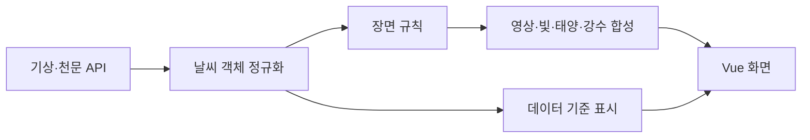

# SKY NOW

기상·천문 데이터를 빛, 구름, 태양 위치와 강수 장면으로 표현하는 **디지털 창문**입니다. 창밖을 보기 어려운 강의실이나 업무 공간에서도 현재 날씨를 수치와 풍경으로 함께 확인할 수 있도록 만들었습니다.

[서비스 열기](https://sky-now-eight.vercel.app) · [장면 엔진·운영 가이드](docs/README-DETAILS.md) · [영상 출처](public/weather-mockup/videos/CREDITS.md)

`Vue 3` · `JavaScript` · `Pinia` · `Leaflet` · `Vite` · `Node.js`

## 현재 구현

| 기능 | 화면에서 확인할 수 있는 것 |
| --- | --- |
| 전국 지역 탐색 | 17개 광역시·도와 229개 시·군·구의 날씨, 지도·검색·상세 화면 |
| 디지털 창문 | 시간대·구름량·풍속·강수에 따른 영상, 팔레트와 날씨 효과 |
| 태양·퇴근길 정보 | 일출·일몰에 따른 태양 위치, 18시 퇴근길 예보와 남은 시간 |
| 데이터 상태 표시 | 최신 API, 최근 저장 데이터, 계절·좌표 기준 대체값의 구분 |
| 보기 설정 | 섭씨·화씨, 날씨 홈·디지털 창문 전환, 1분 창밖 보기 |
| 렌더링 비용 관리 | 화면 밖 영상과 비활성 탭의 영상·강수 Canvas 중단 |

소개 화면은 일출부터 일몰까지를 **12초로 압축한 시연 장면**입니다. 기온·습도 등의 시간대별 변화는 보간된 표현이며 시간별 실측값을 뜻하지 않습니다. 디지털 창문의 영상도 실제 카메라 중계가 아닌 날씨 데이터에 따른 장면 합성입니다.

## 직접 구현한 흐름

기상청 JSON과 한국천문연구원 XML을 하나의 화면용 객체로 정규화하고, 장면 선택 규칙을 영상·색상·태양·강수 레이어에 연결했습니다. 실황과 연출, 캐시와 대체값을 구분하는 문구도 화면의 검수 기준으로 삼았습니다.


```mermaid
flowchart LR
  A[기상·천문 API] --> B[날씨 객체 정규화]
  B --> C[장면 규칙]
  C --> D[영상·빛·태양·강수 합성]
  B --> E[데이터 기준 표시]
  D --> F[Vue 화면]
  E --> F
```

화면·Node 프록시·장면 엔진과 테스트를 연결한 프로젝트입니다. 영상 선택은 규칙 기반이며 생성 모델을 사용하지 않습니다. 사용자 경험의 개선 효과는 별도 사용성 평가가 필요합니다.

## 빠른 실행

Node.js `20.19+` 또는 `22.12+`, npm이 필요합니다. 아래 명령은 저장소를 받은 뒤 실행합니다.

```bash
cd sky-now
npm install
cp .env.example .env.local
```

`.env.local`에 공공데이터포털의 기상청·한국천문연구원 인증키를 입력합니다. 키 변경 후에는 개발 서버를 다시 시작합니다.

```dotenv
KMA_SERVICE_KEY=
ASTRONOMY_SERVICE_KEY=

# 선택 사항: 공개 영상 CDN origin
VITE_MEDIA_BASE_URL=
```

```bash
npm run dev
```

API가 실패하면 화면의 데이터 기준을 확인하세요. 저장 캐시 또는 계절·좌표 기준 대체값이 표시될 수 있습니다. 대체값은 현재 실황이 아닙니다.

### 빌드와 API 확인

```bash
npm run lint
npm test
npm run build
npm start
```

`npm start`는 `http://localhost:4173`에서 정적 파일, `/api/kma-weather`, `/api/astronomy`와 SPA fallback을 함께 제공합니다. `npm run preview`는 정적 번들 확인용이며 API 프록시는 포함하지 않습니다.

| 실행 환경 | API 요청 처리 |
| --- | --- |
| `npm run dev` | Vite 개발 프록시 |
| 빌드 후 `npm start` | 포함된 Node 운영 서버 |
| Vercel 배포 | 포함된 `api/kma-weather.js`, `api/astronomy.js` 함수; 서버 환경변수에 인증키 설정 필요 |
| 순수 정적 호스팅 | `/api/*` 프록시와 SPA rewrite를 별도로 구성 |

현재 배포된 데모의 외부 API 응답은 환경변수·제공처 상태에 따라 달라질 수 있습니다. 위 표는 저장소 코드의 실행 구조를 설명합니다.

## 더 살펴보기

- [장면 엔진·데이터·사용법·실행 및 배포·트러블슈팅](docs/README-DETAILS.md): 세부 규칙, 기존 검사 기록과 향후 확장 계획을 보존했습니다.
- [영상 출처와 라이선스](public/weather-mockup/videos/CREDITS.md): 사용한 외부 영상의 원본 링크를 확인할 수 있습니다.
- `src/features/weather-scene/`: 장면 분류, 팔레트, 영상 선택과 강수 표현 코드입니다.
- `server/weatherProxy.js`: 개발·Node 서버·Vercel 함수가 공유하는 프록시 로직입니다.
- `tests/`: 좌표·장면·캐시 검사를 확인할 수 있습니다.
